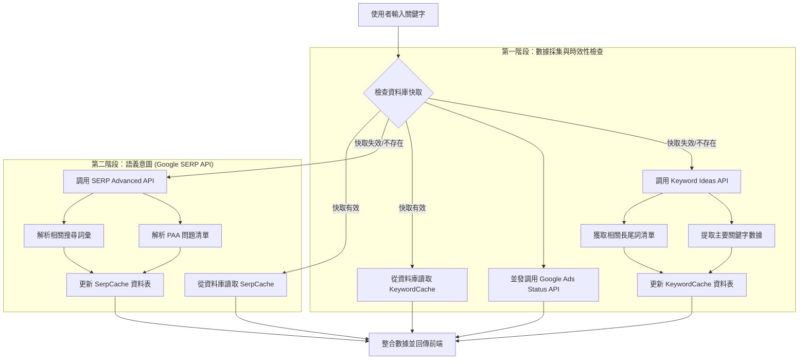

# Seonize 關鍵字研究與意圖分析流程架構

本文件定義了系統在處理關鍵字分析時的後端邏輯流程，包含 **關鍵字擴充 (Keyword Ideas)** 與 **語義意圖獲取 (SERP Intent)** 兩大核心模組。

---

## 1. 總體流程圖

---

## 2. 模組詳細說明

### 模組 A：關鍵字擴充與數據獲取
*   **用途**：獲取商業價值數據（搜尋量、CPC、競爭度）並自動生成長尾詞。
*   **API 節點**：`keywords_data/google_ads/keyword_ideas/live`
*   **快取策略**：使用 `KeywordCache` 表。
    *   **生命週期**：預設為 30 天。
    *   **儲存結構**：核心數據 (`seed_data`) + 建議清單 (`suggestions`)。

### 模組 B：語義意圖與知識點獲取
*   **用途**：透過 SERP 反向工程，獲取用戶真實問題 (PAA) 與搜尋聯想。
*   **API 節點**：`serp/google/organic/live/advanced`
*   **快取策略**：使用 `SerpCache` 表。
    *   **生命週期**：預設為 7 天（SERP 變動較快）。
    *   **儲存結構**：包含有機結果、AI Overview、PAA 問答、相關搜尋。

---

## 3. 性能與成本優化
1.  **快取優先 (Cache-First)**：系統會先詢問資料庫，這將 90% 以上的重複搜尋成本降至 0。
2.  **異步處理 (Asynchronous)**：兩段 API 調用均使用 `httpx` 進行非同步處理，確保系統在高併發下的效率。
3.  **單筆計費極大化**：透過正確配置參數，一次 API 調用即可抓取最完整的資料（例如 Keyword Ideas 一次抓取 1000 個詞，SERP Advanced 一次抓取所有廣告、有機與擴展元件）。

---

---

## 4. NLP 關鍵字提取機制 (次要與 LSI 關鍵字)

系統在獲取 SERP 數據後，會啟動語義分析模組自動萃取兩類延伸詞彙，用於強化內容的 SEO 語義深度。

### A. 次要關鍵字 (Secondary Keywords)
*   **計算機制**：對 Google 前 10 名搜尋結果的 **標題 (Titles)** 進行斷詞頻率分析。除去核心關鍵字與常見停用詞後，提取出現頻率最高的特徵詞（如：公司、費用、推薦）。
*   **核心價值**：找出競品在標題中共同強調的「屬性」或「修飾詞」，作為文章章節規劃的參考。

### B. LSI 關鍵字 (Latent Semantic Indexing)
*   **計算機制**：基於 **TF-IDF (詞頻-逆文件頻率)** 演算法，從前 10 名搜尋結果的 **摘要 (Snippets)** 中提取相關詞彙。
*   **核心價值**：找出與主詞具備強語義關聯的背景詞（如：除跳蚤 -> 環境、防治、噴霧），幫助撰寫文章時擴充語義場景，提高搜尋引擎的信心度。

---

## 5. 未來擴展方向
*   **一鍵式 API (Consolidated API)**：未來可開發一個單一的 Backend Endpoint，同時啟動這兩個任務並整合後回傳，減少前端發送多次 Request 的負擔。
*   **自動更新機制**：偵測到快取過期時，可於背景自動重新抓取最新的 SEO 指標。
*   **提取演算法優化**：計畫加入更精密的「中文停用詞過濾器」與「AI 實體提取」，以減少無意義單字（如助詞）的出現，提供更具商業價值的詞彙。
