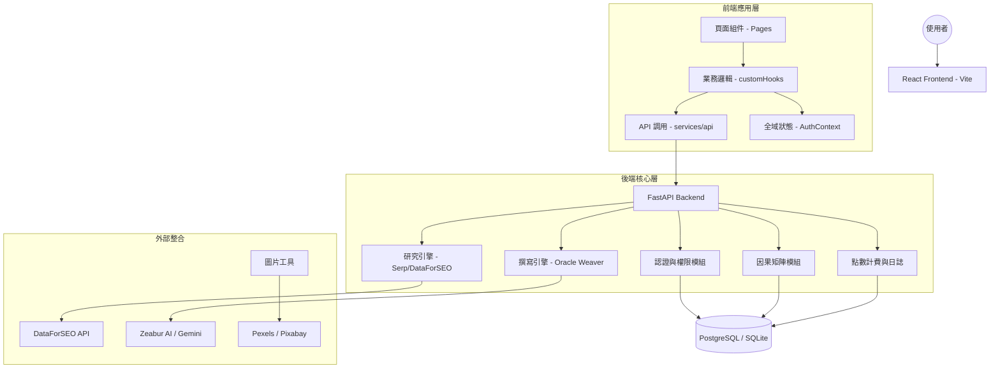

# Seonize (析優) 系統結構設計文件 v3.0

## 1. 系統現狀與核心價值
Seonize 已進化為成熟的數據驅動 AI 文章矩陣系統。目前的穩定版重點在於：
*   **模組化前端**: 透過 Hook 與 Service 層解耦，實現視覺一致性與高品質交互。
*   **自動化因果矩陣**: 「劫之眼術」實現成規模的意圖捕捉與批量內容生成。
*   **多層級守衛**: 點數機制與會籍權限已深度整合至前後端協議。

## 2. 系統架構圖 (Mermaid)

## 3. 關鍵技術架構細節

### 3.1 前端重構模式 (Decoupled Logic)
*   **Pages**: 僅負責 Layout 與視圖組合（如 `KalpaPage.tsx`）。
*   **Hooks**: 封裝所有狀態與 Side Effects（如 `useKalpaMatrix.ts`），確保 UI 修改不影響邏輯。
*   **Services**: 嚴格定義的 `kalpaApi` 等接口，與 `src/types/api.ts` 同步，確保型別安全。

### 3.2 因果之眼 (Kalpa Eye) 自動化流
1.  **天道解析 (Brainstorming)**: AI 基於產業主題自動分析「實體、動作、痛點」。
2.  **矩陣推演 (Modeling)**: 本地生成 N*M 矩陣，不佔用資料庫。
3.  **神諭編織 (Oracle Weaving)**: 
    *   **單點編織**: 即時生成，點數扣除（8 點）。
    *   **批量編織**: 背景佇列處理，深度會員享折扣（最高 7 折）。

### 3.3 點數與會籍守衛機制
*   **Backend**: `get_current_active_user` 依賴項在處理請求前檢查帳號餘額。
*   **Frontend**: API Wrapper 在請求失敗時攔截信用額度不足錯誤，並導向充值或升級頁面。
*   **原子性**: 點數扣除與文章生成採用 Try-Except 結構，生成失敗自動退還點數並記錄日誌。

## 4. 部署架構 (Deployment)
*   **平台**: Zeabur
*   **持久化**: PostgreSQL (資料庫優先策略)。
*   **環境變數**: 透過 Zeabur 控制台動態掛載（詳見 `docs/guides/deployment_zeabur.md`）。

---
*版本：v3.0 (現狀穩定版)*
*最後更新：2026-03-20*
